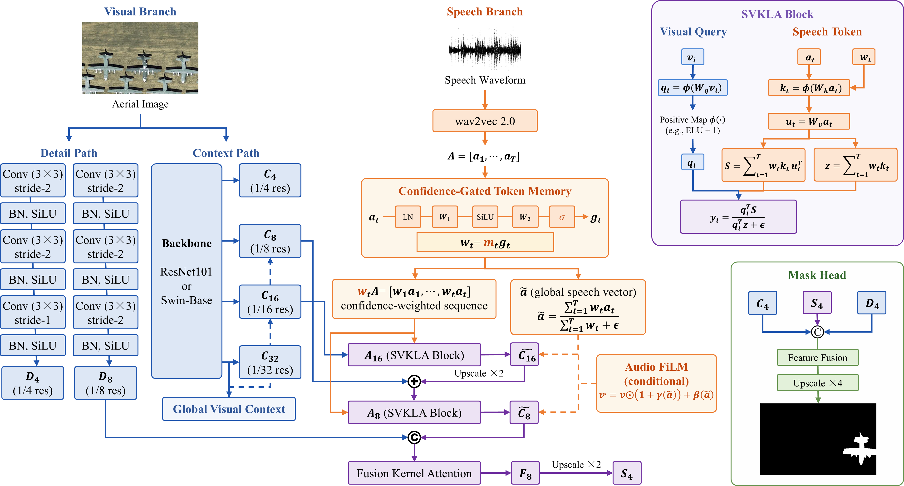

# AeroReformer2

**Aerial Referring Transformer 2 for Audio-Guided Image Segmentation**

[](https://www.python.org/)
[](https://pytorch.org/)
[](https://lironui.github.io/AeroReformer2/)
[](https://huggingface.co/datasets/lironui/VoiceAeroRef)
[](LICENSE)

AeroReformer2 segments an aerial object from an image and a spoken referring
expression. The released model combines a ResNet101 or Swin-B visual backbone,
Wav2Vec2 speech tokens, confidence-gated speech-visual kernel linear attention,
multi-scale context fusion and a 1/4-resolution boundary refinement head.

> **[View the AeroReformer2 project page →](https://lironui.github.io/AeroReformer2/)**  
> Explore the architecture, VoiceAeroRef pipeline and qualitative comparisons
> in an interactive, full-resolution presentation.

This public repository intentionally contains only the two AeroReformer2
backbone versions. Baseline implementations and internal ablation variants are
not included.

<p align="center">
  
</p>

## Highlights

- Audio-guided referring segmentation for aerial and remote-sensing imagery.
- Token-preserving Wav2Vec2 speech branch with learned token confidence.
- Linear speech-visual attention at 1/16 and 1/8 resolutions.
- Shared 1/4 high-resolution refinement for precise masks.
- ResNet101 and Swin-B backbone releases.
- End-to-end data preparation, training, validation, prediction and profiling.
- Clean and controlled hard-speech evaluation through
  [VoiceAeroRef](https://huggingface.co/datasets/lironui/VoiceAeroRef).

## Repository structure

```text
AeroReformer2/
├── aeroreformer2/
│   ├── audio.py          # Wav2Vec2 and lightweight token encoders
│   ├── data.py           # VoiceAeroRef + RISBench loader
│   ├── model.py          # AeroReformer2 only
│   ├── train.py          # training and clean-validation selection
│   ├── evaluate.py       # metrics and mask export
│   ├── predict.py        # prediction entry point
│   ├── profile.py        # parameters, latency, throughput and GPU memory
│   └── metrics.py        # mIoU, oIoU and Pr@{0.5,...,0.9}
├── scripts/
│   └── prepare_voiceaeroref.py
├── slurm/                # example MIT ORCD jobs
├── tests/
├── dataset_card/         # README for the Hugging Face dataset repository
├── docs/                 # deployable GitHub Pages project site
└── .github/workflows/    # test and Pages workflows
```

## Installation

Clone and create an isolated environment:

```bash
git clone https://github.com/lironui/AeroReformer2.git
cd AeroReformer2

python -m venv .venv
source .venv/bin/activate
python -m pip install --upgrade pip
pip install -e .
```

Install the PyTorch build appropriate for your CUDA driver before
`pip install -e .` when the default PyPI wheel is not suitable. Confirm GPU
access:

```bash
python -c "import torch; print(torch.__version__, torch.cuda.is_available())"
```

## Data

### 1. Download and prepare VoiceAeroRef

VoiceAeroRef is hosted at
[lironui/VoiceAeroRef](https://huggingface.co/datasets/lironui/VoiceAeroRef).
The release is WebDataset-based; the preparation script downloads selected
shards, optionally verifies SHA-256 checksums, extracts WAV files and creates
the JSONL manifests consumed by this repository.

Prepare the clean training, validation and test data:

```bash
python scripts/prepare_voiceaeroref.py \
  --output data/VoiceAeroRef \
  --configs clean \
  --verify-checksums
```

Add hard validation and test data:

```bash
python scripts/prepare_voiceaeroref.py \
  --output data/VoiceAeroRef \
  --configs hard \
  --verify-checksums
```

To use a snapshot already downloaded with `hf download`:

```bash
python scripts/prepare_voiceaeroref.py \
  --snapshot-dir /path/to/VoiceAeroRef \
  --output data/VoiceAeroRef \
  --configs clean hard
```

Expected manifests:

```text
data/VoiceAeroRef/manifests/
├── train.jsonl
├── validation.jsonl
├── test.jsonl
├── validation_hard.jsonl
└── test_hard.jsonl
```

### 2. Prepare RISBench images and masks

VoiceAeroRef distributes speech and metadata only. Obtain RISBench separately
and arrange either of these supported forms:

```text
data/RISBench/
├── rgb/                  # or img_rgb/
│   ├── train_*.png
│   ├── val_*.png
│   └── test_*.png
└── mask/
    ├── train_*.png
    ├── val_*.png
    └── test_*.png
```

or a Hugging Face `DatasetDict` saved with `save_to_disk`. Verify file-backed
data while preparing VoiceAeroRef:

```bash
python scripts/prepare_voiceaeroref.py \
  --output data/VoiceAeroRef \
  --configs clean \
  --risbench-root data/RISBench
```

The complete dataset construction protocol is shown below.

<p align="center">
  
</p>

## Training

Swin-B:

```bash
python -m aeroreformer2.train \
  --model aeroreformer2_swin_b \
  --risbench-root data/RISBench \
  --audio-root data/VoiceAeroRef \
  --train-manifest data/VoiceAeroRef/manifests/train.jsonl \
  --val-manifest data/VoiceAeroRef/manifests/validation.jsonl \
  --output runs/aeroreformer2_swin_b \
  --batch-size 4 \
  --epochs 40 \
  --lr 2e-4 \
  --backbone-lr 2e-5 \
  --device cuda
```

ResNet101:

```bash
python -m aeroreformer2.train \
  --model aeroreformer2_resnet101 \
  --risbench-root data/RISBench \
  --audio-root data/VoiceAeroRef \
  --train-manifest data/VoiceAeroRef/manifests/train.jsonl \
  --val-manifest data/VoiceAeroRef/manifests/validation.jsonl \
  --output runs/aeroreformer2_resnet101 \
  --batch-size 4 \
  --epochs 40 \
  --lr 2e-4 \
  --backbone-lr 2e-5 \
  --device cuda
```

Training samples one of the eight voices for each source in every epoch.
Checkpoint selection uses clean validation mIoU. `best.pt`, `last.pt`,
`history.csv`, `args.json` and `best_metrics.json` are written to the output
directory. Training starts fresh unless `--resume PATH` is explicitly passed.

On MIT ORCD:

```bash
MODEL=aeroreformer2_swin_b sbatch slurm/train.sbatch
```

## Evaluation

Evaluate clean and hard test manifests in one pass:

```bash
python -m aeroreformer2.evaluate \
  --checkpoint runs/aeroreformer2_swin_b/best.pt \
  --manifests \
    clean=data/VoiceAeroRef/manifests/test.jsonl \
    hard=data/VoiceAeroRef/manifests/test_hard.jsonl \
  --risbench-root data/RISBench \
  --audio-root data/VoiceAeroRef \
  --output outputs/test_metrics.json \
  --prediction-root outputs/predictions \
  --batch-size 8 \
  --device cuda
```

Reported metrics:

```text
mIoU, oIoU, Pr@0.5, Pr@0.6, Pr@0.7, Pr@0.8, Pr@0.9
```

Binary prediction masks are saved as 0/255 PNGs under two-character hash
shards, so no directory exceeds common 10,000-file hosting limits.

## Inference from Python

```python
import torch
from aeroreformer2.model import build_model, checkpoint_model_config

checkpoint = torch.load("best.pt", map_location="cpu", weights_only=False)
model = build_model(**checkpoint_model_config(checkpoint["model_config"]))
model.load_state_dict(checkpoint["model"], strict=True)
model.cuda().eval()

with torch.inference_mode():
    logits = model(image.cuda(), audio.cuda(), audio_length.cuda())
    mask = logits.sigmoid() >= 0.5
```

Input shapes are:

```text
image:        [B, 3, H, W]
audio:        [B, samples]       # 16 kHz waveform
audio_length: [B]
logits:       [B, 1, H, W]
```

## Efficiency profiling

```bash
python -m aeroreformer2.profile \
  --models aeroreformer2_swin_b aeroreformer2_resnet101 \
  --image-size 352 \
  --iterations 50 \
  --device cuda \
  --amp \
  --output outputs/profile.json
```

The profiler reports parameters, batch latency, images per second and peak GPU
memory. Report the GPU model, software versions, image size, batch size and AMP
setting alongside efficiency numbers.

## Tests

```bash
python -m unittest discover -s tests -v
```

Tests cover both visual backbones, output shape and finiteness, the complete
metric set, WebDataset extraction, RISBench path resolution and the absence of
baseline/ablation model APIs.

## GitHub Pages

The static project page lives in `docs/`. The workflow in
`.github/workflows/pages.yml` deploys it through GitHub Pages. In the repository
settings, select **Pages → Source → GitHub Actions**, then push to `main`.

## Data and code licenses

The code in this repository is released under the [MIT License](LICENSE).
VoiceAeroRef and RISBench may have separate terms. The code license does not
grant rights to redistribute upstream imagery, masks, annotations or generated
speech. Review and set the final VoiceAeroRef dataset license before making the
dataset repository public.

## Citation

Replace the placeholder author list and publication fields after the paper is
accepted:

```bibtex
@article{aeroreformer2,
  title   = {AeroReformer2: Aerial Referring Transformer 2 for Audio-Guided Image Segmentation},
  author  = {AeroReformer2 Authors},
  year    = {2026}
}
```

For the dataset:

```bibtex
@dataset{voiceaeroref2026,
  title  = {VoiceAeroRef: Audio-Guided Referring Segmentation for Aerial Imagery},
  author = {AeroReformer2 Authors},
  year   = {2026},
  url    = {https://huggingface.co/datasets/lironui/VoiceAeroRef}
}
```
