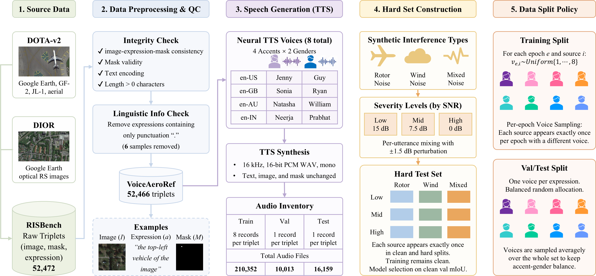

---
language:
- en
tags:
- audio
- remote-sensing
- referring-image-segmentation
- multimodal
- webdataset
task_categories:
- image-segmentation
configs:
- config_name: clean
  data_files:
  - split: train
    path: data/clean/train-*.tar
  - split: validation
    path: data/clean/validation-*.tar
  - split: test
    path: data/clean/test-*.tar
- config_name: hard
  data_files:
  - split: validation
    path: data/hard/validation-*.tar
  - split: test
    path: data/hard/test-*.tar
---

# VoiceAeroRef

VoiceAeroRef is an audio-guided referring image segmentation resource for
aerial and remote-sensing imagery. It pairs RISBench image-expression-mask
triplets with spoken English referring expressions and provides controlled
speech-corruption splits for robustness evaluation.

<p align="center">
  
</p>

## Dataset summary

The release contains 262,696 audio-metadata records in 44 deterministic
WebDataset TAR shards (approximately 45.05 GB). Audio is stored as 16 kHz,
mono, PCM16 WAV.

| Configuration | Split | Records | Voice policy |
|---|---:|---:|---|
| clean | train | 210,352 | eight voices per valid source |
| clean | validation | 10,013 | one balanced voice per expression |
| clean | test | 16,159 | one balanced voice per expression |
| hard | validation | 10,013 | one controlled corruption per expression |
| hard | test | 16,159 | one controlled corruption per expression |

The source audit starts from 52,472 RISBench triplets. Six training sources
whose expression contains only punctuation are excluded, leaving 52,466 valid
image-expression-mask triplets.

## Speech inventory

Clean speech uses eight English neural voices:

| Locale | Accent | Female voice | Male voice |
|---|---|---|---|
| en-US | US | Jenny | Guy |
| en-GB | GB | Sonia | Ryan |
| en-AU | AU | Natasha | William |
| en-IN | IN | Neerja | Prabhat |

For training, every valid source has all eight voices. The intended training
protocol samples exactly one voice for each source in each epoch. Validation
and test use one deterministically balanced voice per expression.

## Hard configuration

The hard validation and test splits use three synthetic interference types:

- rotor noise;
- wind noise;
- mixed rotor and wind noise.

Each type has low, medium and high severity, centred at 15 dB, 7.5 dB and
0 dB SNR respectively, with deterministic per-utterance perturbation. Training
speech remains clean.

## Record format

Every WebDataset example contains a WAV file and a JSON file with the same key:

```text
test_000000__au_female.wav
test_000000__au_female.json
```

The JSON metadata contains fields such as:

```json
{
  "sample_id": "test_000000",
  "source_index": 0,
  "image": "img_rgb/test_0_0.png",
  "mask": "mask/test_0_0.png",
  "phrase": "The baseball field featured in the image ...",
  "voice": "en-AU-NatashaNeural",
  "accent": "AU",
  "gender": "female",
  "locale": "en-AU",
  "voice_id": "au_female",
  "config": "clean",
  "split": "test",
  "condition": "clean"
}
```

Hard examples additionally contain `noise_type`, `severity`, `snr_db` and
`noise_seed`.

## Loading with 🤗 Datasets

Streaming avoids downloading the complete release:

```python
from datasets import load_dataset

dataset = load_dataset(
    "lironui/VoiceAeroRef",
    "clean",
    streaming=True,
)
sample = next(iter(dataset["train"]))
print(sample.keys())
```

Hard evaluation data:

```python
hard = load_dataset(
    "lironui/VoiceAeroRef",
    "hard",
    split="test",
    streaming=True,
)
sample = next(iter(hard))
```

## Downloading files

Install the Hugging Face CLI:

```bash
pip install -U huggingface_hub
```

Download the complete repository:

```bash
hf download lironui/VoiceAeroRef \
  --repo-type dataset \
  --local-dir VoiceAeroRef
```

Download only clean test shards and release metadata:

```bash
hf download lironui/VoiceAeroRef \
  --repo-type dataset \
  --include "data/clean/test-*.tar" \
  --include "release_manifest.json" \
  --include "checksums.sha256" \
  --local-dir VoiceAeroRef
```

The companion AeroReformer2 repository includes
`scripts/prepare_voiceaeroref.py`, which downloads selected configurations,
checks optional SHA-256 digests, extracts WAV files and writes training-ready
JSONL manifests.

## Images and masks

This repository distributes speech and metadata only. RISBench imagery and
masks are not duplicated. The `image` and `mask` fields preserve the original
RISBench references; users must obtain RISBench separately and comply with its
terms.

## Integrity and exclusions

- `release_manifest.json` records every shard, record count, byte size and
  SHA-256 digest.
- `checksums.sha256` provides a checksum list suitable for independent
  verification.
- `excluded_samples.jsonl` documents the six invalid punctuation-only source
  expressions.

## Intended use

VoiceAeroRef supports research on:

- audio-guided referring segmentation;
- aerial and remote-sensing scene understanding;
- speech robustness under rotor and wind interference;
- accent- and gender-aware evaluation.

It is not designed for speech recognition benchmarking, speaker
identification, surveillance decisions or safety-critical deployment.

## Limitations

- Speech is synthesized and does not reproduce the full variability of human
  speech.
- The release contains English speech with four accent groups.
- Corruptions are controlled synthetic conditions rather than recordings from
  every real flight environment.
- Dataset performance depends on the coverage and annotation properties of
  RISBench.

## Licensing and attribution

This dataset card does not grant additional rights to RISBench imagery or
annotations. Users and redistributors must comply with the original RISBench
terms and with any terms governing the speech-generation service. Before
public release, the publisher should add the final dataset license selected
after verifying compatibility with those upstream terms.

## Citation

```bibtex
@dataset{voiceaeroref2026,
  title   = {VoiceAeroRef: Audio-Guided Referring Segmentation for Aerial Imagery},
  author  = {AeroReformer2 Authors},
  year    = {2026},
  url     = {https://huggingface.co/datasets/lironui/VoiceAeroRef}
}
```
